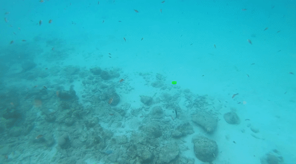

# Fish tracking lib for tracking fish in moving camera setup.

This repo is a fish tracking lib on top of mmtracking lib to track fishes in moving camera setup. The lib contain the possibility to train/evaluated and demo vids of predator prey interaction. The general purpose of this repo is to create a working tracking solution and to create some functionalities on top of that such as a GUI to load videos, process frames, correct tracking behaviour and save tracks.

## Project status 
**Work in progress.**

# Visuals

# Installation

To install this repo on can simply clone or fork it and following the instructions for installing mmtracking repo [Here](https://github.com/open-mmlab/mmtracking/blob/master/docs/en/install.md)

# Usage

# Support

# Roadmap

# Authors and acknowledgment
Casper Thuis

# License